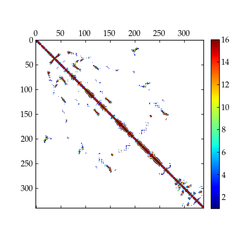

# EZ-CMAP
Calculate contact number map between selected residues

### Usage:
- Compile with `make` in the program root folder, then executable can be found in `bin/`.
- Run with `./ez-cmap input.dat`

### Example Input:
```
# Read input
psfname input.psf
dcdname input.dcd
dcdspec all

cutoff  8.0

# Define selections
sele1
    resid 1:340
    type CA N C O
    segid SEGI
end

sele2
    resid 1:340
    type CA N C O
    segid SEGI
end

# Outname prefix of cmap file, full name will be ${outname}-frame${framenum}.dat
outpref cmap_out
```
*Note*: 
- `dcdspec` will specify which frame to use: integer (e.g. `dcdspec 3`) for a certrain frame or `dcdspec all` for every frame.
- The `resid` selection should be a complete string (e.g. `1:340`) without any space seperations.
- Currently the program only supports single residue range or segid but multiple atom types.
- The residue range (`resid`) is enssentially an intersection of specified range and available range.

### Result:


